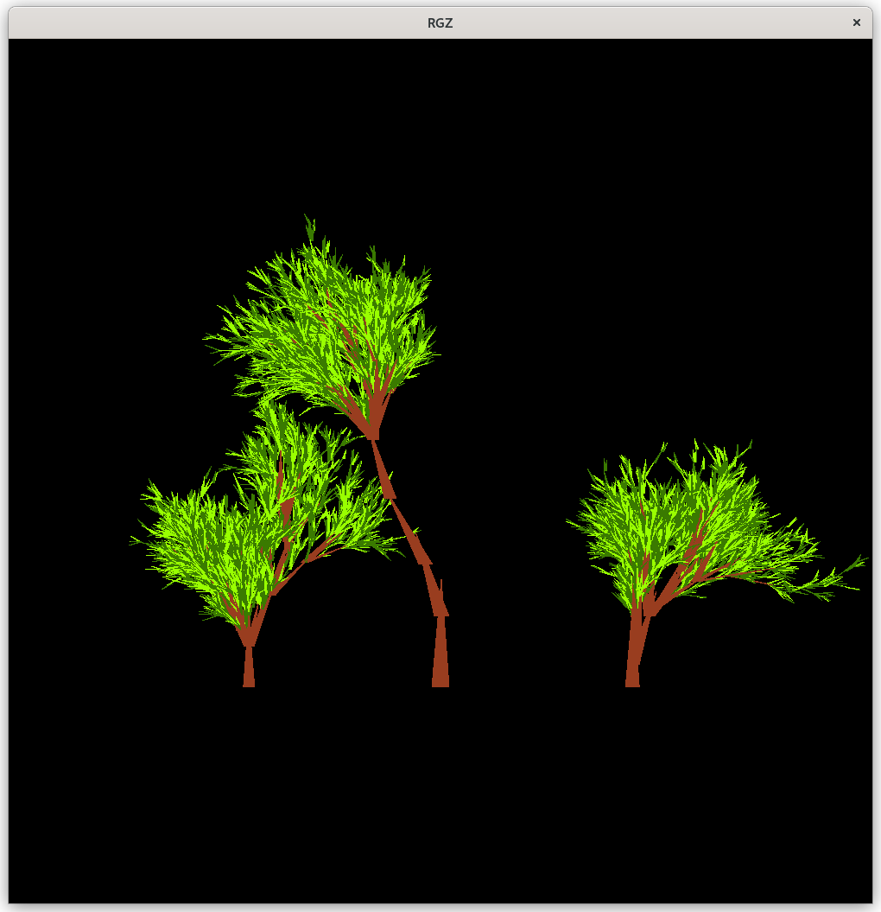
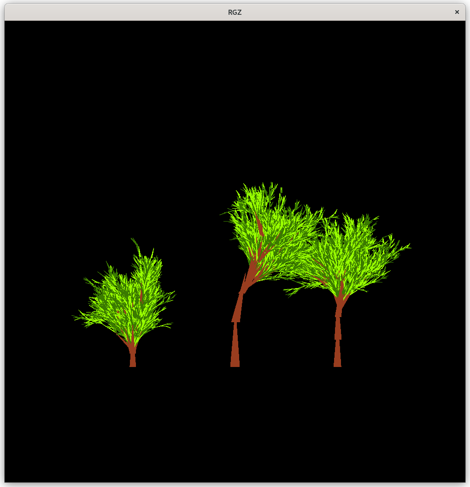

# Расчетная графическая работа по компьютерной графике
<strong>В качестве графической составляющей используется OpenGL<strong>

# Задание

## Фрактальная графика - отрисовка деревьев 

Весь код находится в файле `fractal.c`, стадния сборки мейкфайла `all`

### Использованные библиотеки
>\<Glut> <pre>набор утилит для OpenGL</pre> \
><math.h> <pre>математические операции</pre> \
><time.h> <pre>для работы с временем</pre>

### Логика отрисовки дерева
дерево разбивается на составляющие, которые отрисовываются отдельно
<pre>
Дерево  -----> Стволы ---> Ветки
          \
           -----> Лист -----> Светло-зеленая часть листа
                          \
                           -----> Темно-зеленая часть листа
</pre>
* Является значения текущего спуска Стволом или Листком определяется в зависимости от его длины.
* Существует ограничение на минимальную и максимальную длину: 
Меньше минимума - не отрисовываем.
Больше максимума - нормируем.
* Затем создается случайное количество веток на текущем проходе, для каждой ветки рекурсивно вызывается функция прорисовки.
* Существует условие остановки рекурсии в случае более 30 тысяч проходов. 

