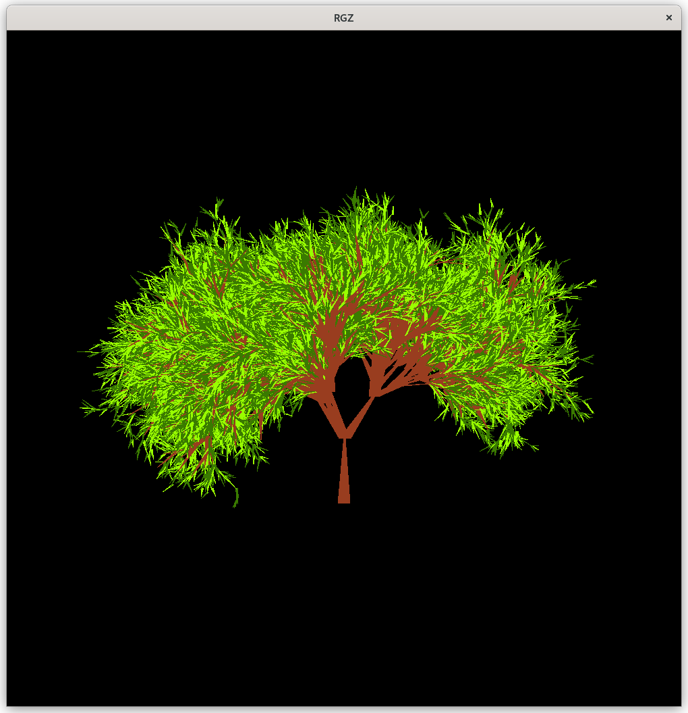

# Расчетная графическая работа по компьютерной графике
<strong>В качестве графической составляющей используется OpenGL<strong>

# Задание

## Фрактальная графика - отрисовка деревьев

Весь код находится в файле `fractal.c`, стадния сборки мейкфайла `all`

### Использованные библиотеки
>\<Glut> <pre>набор утилит для OpenGL</pre> \
><math.h> <pre>математические операции</pre> \
><time.h> <pre>для работы с временем</pre>

### Логика отрисовки дерева
Представим дерево в виде: \
Дерево  -----> Стволы ---> Ветки
<pre>     \</pre>
           -----> Лист -----> Светло-зеленая часть листа
                            \
                             -----> Темно-зеленая часть листа

